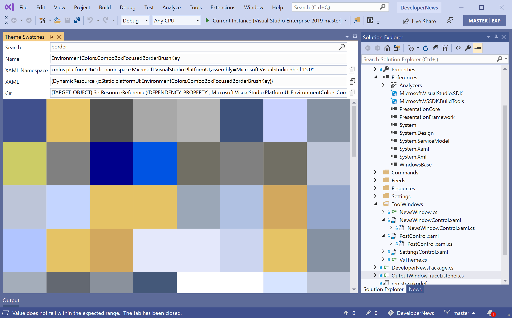

# Visual Studio Theme Colors

Makes it easy to browse all the brushes and select the right theme color for your Visual Studio extension UI.

Download this extension from the [Marketplace](https://marketplace.visualstudio.com/items?itemName=MadsKristensen.VSThemeColors)
or get the [CI build](https://www.vsixgallery.com/extension/6ad27930-f7a1-4888-a172-c6fa4440e7a0/).

----------------------------------------------

Search for colors and copy them easily in the various formats.

Open the Theme Swatches window from **View -> Other Windows - Theme Swatches**.

## License
[Apache 2.0](LICENSE)